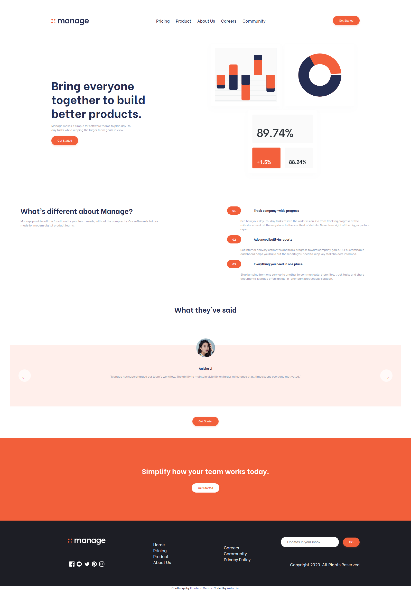

# Frontend Mentor - Bookmark landing page solution

## Table of contents

- [Overview](#overview)
  - [The challenge](#the-challenge)
  - [Screenshot](#screenshot)
  - [Links](#links)
- [My process](#my-process)
  - [Built with](#built-with)
  - [What I learned](#what-i-learned)
- [Author](#author)

**Note: Delete this note and update the table of contents based on what sections you keep.**

## Overview

### The challenge

Users should be able to:

- View the optimal layout for the site depending on their device's screen size
- See hover states for all interactive elements on the page
- Receive an error message when the newsletter form is submitted if:
  - The input field is empty
  - The email address is not formatted correctly

### Screenshot

### Links

- Solution URL: [here](https://github.com/AAtomic-M/...)
- Live Site URL: [here](https:// .netlify.app/)

## My process

I used GNU Image Manipulation Program to open design .jpg's and with the measure tool took the distances and angles from design.
Made hole HTML5 markup first then CSS , and implemented some JS on the end. Using Ubuntu 20.04.2 LTS as OS.

### Built with

- VScode
- Chromium Web Browser
- Semantic HTML5 markup
- CSS custom properties
- Flexbox
- CSS Grid
- Mobile-first workflow
- Vanila JS

### What I learned

Everything i did in this page was a nice chalenge because this is one of my first front-end projects.

## Author

- Frontend Mentor - [@AAtomic-M](https://www.frontendmentor.io/profile/AAtomic-M)
